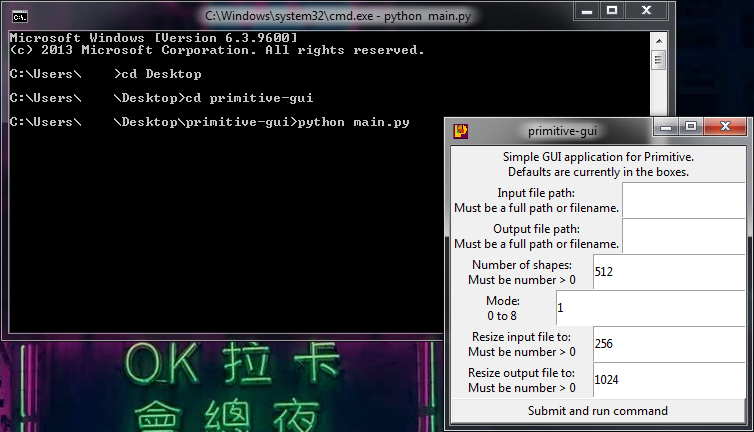

# **primitive-gui**
A simple GUI for primitve by fogleman.
## **Why was this made?**
I just wanted a GUI for this command-line tool, and it happens to *not* have a GUI version on Windows.

*It only has one on macOS.*

This script can most likely, be easily reworked to run on Linux, however I main Windows, so...
## **Requirements:**
- Go > https://golang.org/doc/install
- Primitive > https://github.com/fogleman/primitive (script is included if you're a super-noob)
- Python3 > https://www.python.org/downloads/release/python-399/ (Select 64-bit Windows Installer)

## **How to install/use:**
- Navigate to the folder in a terminal
- To install Primitive, run ```python install-primitive.py```
- Once primitive is done installing, you may delete the install script.
- To run the GUI, run ```python main.py```
- ## **THE APPLICATION WILL APPEAR TO FREEZE, THIS IS NORMAL. LEAVE IT BE UNTIL IT IS FINISHED PROCESSING.**

## **GUI layout:**

### **Input file Path**
You can point to an image via it's full path, or you can place the image in the folder containining the script.
### **Ouput file path**
You can point to an image via it's full path, or you can type the name of the output, and Primitive will output the file to where the script is.
### **Number of shapes**
The amount of shapes Primitive will use to redraw your image.
### **Mode**
Must be a number from 0 to 8,
- 0 = Combination of all shapes
- 1 = Only triangles
- 2 = Only rectangles
- 3 = Only ellipses
- 4 = Only circles
- 5 = Only <ins>rotated</ins> rectangles
- 6 = Only bezier curves
- 7 = Only <ins>rotated</ins> ellipses
- 8 = Only polygons
### **Resize input file**
The size Primitive will resize your image to when it runs it through, recommended small numbers.
### **Resize output file**
How large the final image will be after Primitive has redrawn it.
